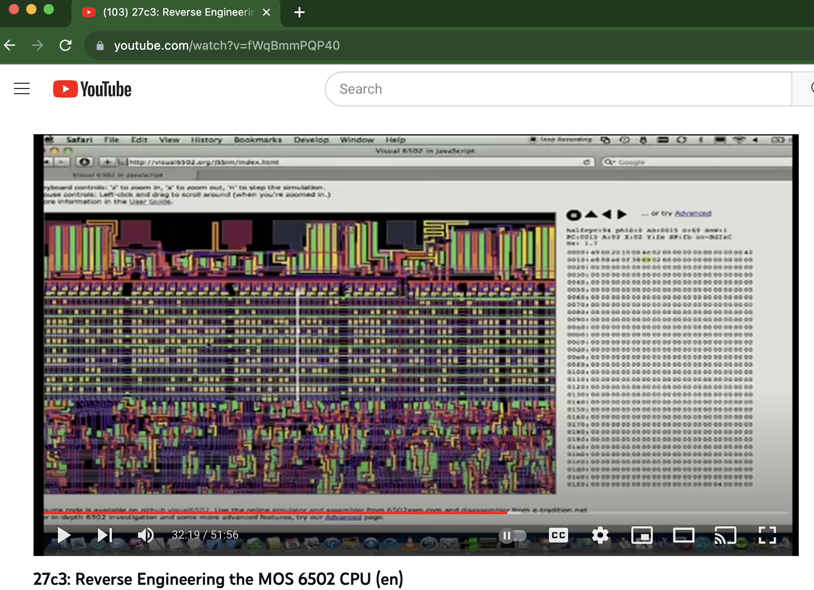

This is an example document with an embedded SVG:

  
  

<svg style="width: 84.92mm; height: 68.24mm;" width="8492" height="6824" viewBox="0 0 8492 6824" xmlns:xlink="http://www.w3.org/1999/xlink" xmlns="http://www.w3.org/2000/svg">

<g>
<svg style="" width="5500" height="6824" viewBox="0 0 5500 6824" xmlns:xlink="http://www.w3.org/1999/xlink" xmlns="http://www.w3.org/2000/svg">

<path d="M 8472 0 L 12860 6080 11050 6797 16577 12007 14767 12877 21600 21600 10012 14915 12222 13987 5022 9705 7602 8382 0 3890 Z" transform="undefined" style=" stroke-width: 0.0102in; stroke: #000000; stroke-line-join: round; fill: #cfe2f3;" ></path>
</svg>
</g>
<g transform="translate(5167, 953)">
<svg style="" width="3325" height="2197" viewBox="0 0 3325 2197" xmlns:xlink="http://www.w3.org/1999/xlink" xmlns="http://www.w3.org/2000/svg">

<path d="M 0 0 L 3325 0 L 3325 2197 L 0 2197 Z" transform="undefined" style=" stroke-width: 0.0102in; stroke: #000000; stroke-line-join: round; fill: #cfe2f3;" ></path>
</svg>
</g>
</svg>
  
**INSTEAD OF EMBEDDED DIAGRAM ABOVE USE EMBEDDED DIAGRAM FROM DRIVE AND PUT LINK TO IT IN THE DESCRIPTION. See: https://github.com/mieweb/wikiGDrive/issues/353**  

This will not work.

The work-around is to make
