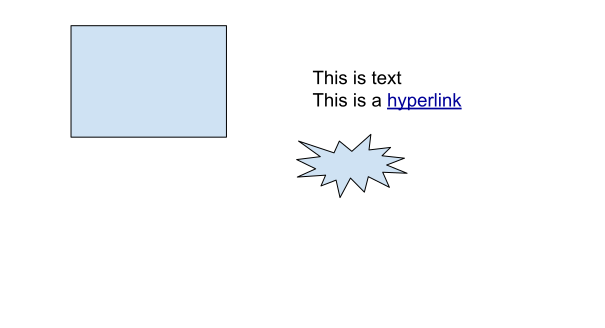
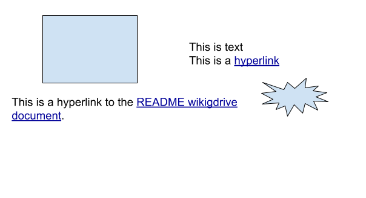

The image should show up.  Here is a link back to the [README](readme.md).
<svg width="100%" viewBox="0 0 1000 1000" fill="none" stroke="none" xmlns:xlink="http://www.w3.org/1999/xlink" xmlns="http://www.w3.org/2000/svg">
<g transform="translate(15, 66)">
<path fill="none" stroke="black" d="M 0 0 L 100 0 100 100 0 100 Z" />
</g>
<g transform="translate(0, 229)">
<path fill="none" stroke="black" d="M 0 0 L 100 0 L 100 100 L 0 100 Z" />
</g>
<g transform="translate(565, 332)">
<text fill="black" x="0" dy="1em" font-size="1em">Label</text>
<path fill="none" stroke="black" d="M 0 0 L 100 0 100 0 100 100 0 100 Z" />
</g>
<g transform="translate(144, 394)">
<path fill="none" stroke="black" d="M 0 0 L 100 0 100 100 0 100 Z" />
</g>
<g transform="translate(303, 0)">
<text fill="black" x="0" dy="1em" font-size="1em">Hyperlinks do not work in embedded drawings</text>
<text fill="black" x="0" dy="1em" font-size="1em">because of Google.  ;-)</text>
<path fill="none" stroke="black" d="M 0 0 L 100 0 100 100 0 100 Z" />
</g>
</svg>

after

Image from file:

done

Inserted as unlinked:

done
